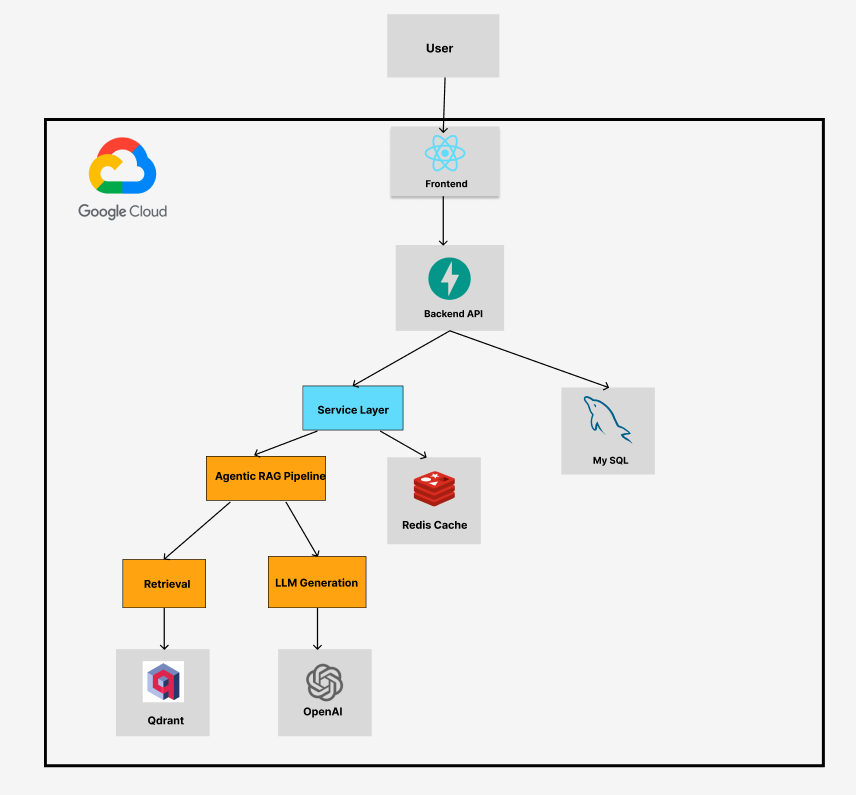
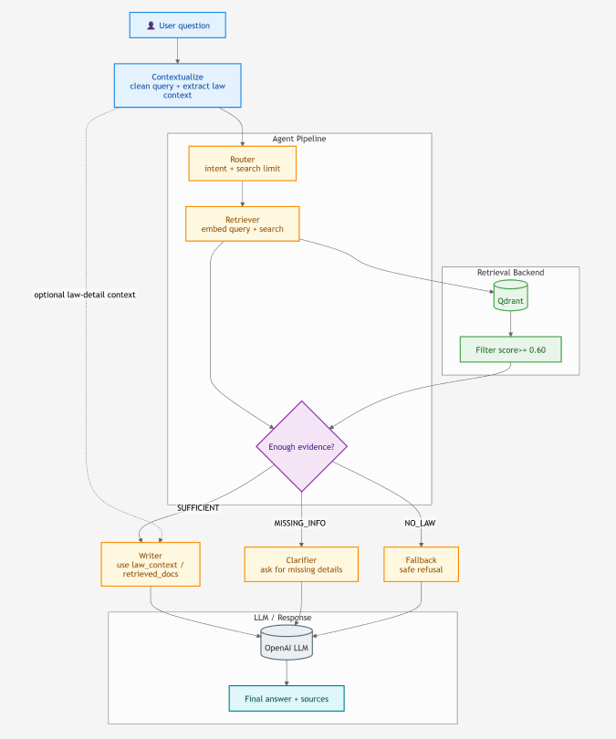
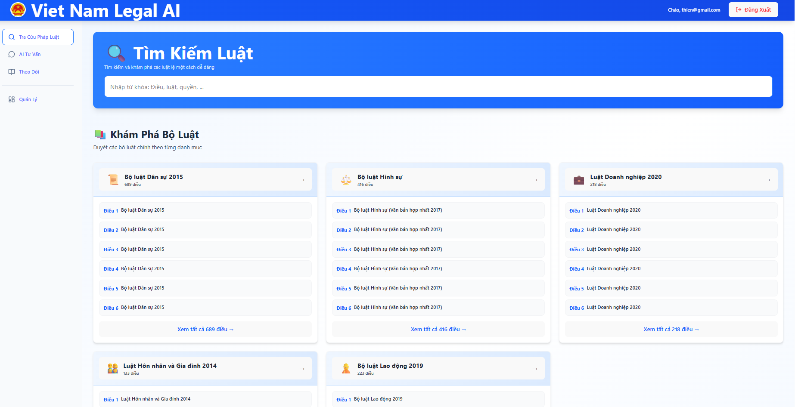

# VN Legal Intelligence Platform

VN Legal Intelligence Platform is a production-grade legal information system leveraging Retrieval-Augmented Generation (RAG) to provide accurate answers to Vietnamese legal queries. The system combines a FastAPI backend, a React/TypeScript frontend, and a multi-agentic workflow to ensure high-quality, context-aware legal assistance with verifiable citations.

---

## Evaluation Summary

The system is continuously validated using a specialized evaluation framework for RAG systems aligned with the **R2AI 2026 Benchmark** criteria.

**Status: PASS (Production Ready)**

| Metric Category | Metric Name | Score / Value |
| --- | --- | --- |
| **Answer Generation Quality (Avg QA)** | **Chính xác nội dung (Accuracy)** | 4.73 / 5.0 |
| | **Đầy đủ & toàn diện (Completeness)** | 4.07 / 5.0 |
| | **Thực tiễn & áp dụng (Relevance)** | 4.67 / 5.0 |
| | **Final Avg QA Score** | **4.51 / 5.0** |
| **Retrieval Quality (Docs & Articles)** | **MRR (Ranking Precision)** | 0.622 |
| | **nDCG (Ranking Quality)** | 0.656 |
| | **Docs Recall (Keyword Coverage)** | 82.2% |
| **Performance Metrics** | **Avg Latency** | 5.07s / query |

**Note:** All quality gates have been passed (Thresholds: MRR ≥ 0.62, nDCG ≥ 0.62, Accuracy ≥ 4.4). Detailed reports are generated in `tests/results/reports/`.

---

## System Architecture

### Overall Architecture



### RAG Agent Flow



---

### Platform Interface



---

## Table of Contents

1. [Features](#1-features)
2. [Architecture](#2-architecture)
3. [Project Structure](#3-project-structure)
4. [Prerequisites](#4-prerequisites)
5. [Installation and Setup](#5-installation-and-setup)
6. [API Overview](#6-api-overview)
7. [Evaluation Framework](#7-evaluation-framework)

---

## 1. Features

- Semantic Search: Multi-lingual law document retrieval using Qdrant vector database.
- Agentic RAG: 7-node LangGraph pipeline for reasoning and information verification.
- Multi-turn Chat: Persistent conversation history with context-aware responses.
- User Management: Secure authentication (JWT), law bookmarking, and query tracking.
- Admin Dashboard: Comprehensive usage statistics and user management.
- Deployment Ready: Fully automated MLOps pipeline with GitHub Actions and Google Cloud Platform.
- Production Optimized: Pre-indexed vector models and containerized architecture for sub-second startup latency.
- Enterprise Security: Centralized secret management via Google Secret Manager and secure VPC-ready networking.

---

## 2. Architecture

### Backend (FastAPI & LangGraph)

The RAG pipeline operates through 7 specialized logic nodes:

1. Contextualize: Rewrites queries based on chat history.
2. Router: Classifies intent and optimizes retrieval strategy.
3. Retriever: Performs semantic search in Qdrant.
4. Checker: Validates if retrieved laws are sufficient to answer.
5. Writer: Generates the final legal response with citations.
6. Clarifier: Asks for more details if the user query is ambiguous.
7. Fallback: Handles error states or "no law found" scenarios.

### Tech Stack

- AI/LLM: OpenAI GPT-4o-mini, LangGraph, Pydantic v2.
- Database: Qdrant (Vector), MySQL (Relational), Redis (Cache).
- Infrastructure: Google Cloud Run (Serverless), Cloud SQL (Managed MySQL).
- MLOps: GitHub Actions, Artifact Registry, Secret Manager.
- Frontend: React 19, Vite, TailwindCSS.

---

## 3. Project Structure

```text
VN_Legal_Intelligence_Platform/
├── app/                        # FastAPI Backend engine
│   ├── api/v1/                 # REST Endpoints (Auth, RAG Chat, Admin)
│   ├── core/                   # Infrastructure (Security, Cloud Config, Clients)
│   ├── services/               # RAG Agent (LangGraph) & AI Orchestration
│   └── models/                 # Database Schemas (SQLAlchemy ORM)
├── frontend/                   # React 19 + Vite + TypeScript Application
├── .github/workflows/          # MLOps Pipelines (CI/CD & Auto-Deploy)
├── docs/                       # Project Documentation & High-level Architecture
├── tests/                      # Unit Tests & RAG Evaluation Suite
├── scripts/                    # Maintenance, Data Import & Model Setup
├── Dockerfile.backend          # Production-optimized Backend container
├── Dockerfile.frontend         # Production-optimized Frontend container
├── docker-compose.yml          # Local infrastructure orchestration
└── RUN_EVALUATION.py           # Master Quality Gate for RAG metrics
```

---

## 4. Prerequisites

- Python 3.11+
- Anaconda or Miniconda (recommended)
- Docker Desktop
- OpenAI API Key

---

## 5. Installation and Setup

### Step 1: Environment Setup

```bash
# Clone the repository
git clone https://github.com/adamwhite625/VN_Legal_Intelligence_Platform.git
cd VN_Legal_Intelligence_Platform

# Create and activate environment
conda create -n legal_bot python=3.11
conda activate legal_bot

# Install dependencies
pip install -r requirements.txt

# Setup environment variables
cp .env.example .env
# Edit .env with your configuration (specifically OPENAI_API_KEY)
```

### Step 2: Infrastructure and Database

```bash
# Start backend infrastructure (MySQL, Qdrant, Redis)
docker-compose up -d

# Initialize database tables and admin account
python scripts/create_tables.py
python scripts/create_admin.py
```

### Step 3: Import Data to Qdrant Vector Database

```bash
# Run the import script from project root
cd scripts
python import_local.py
cd ..
```

### Step 4: Run the Application

```bash
# Start the Backend
uvicorn app.main:app --reload

# Start the Frontend
cd frontend
npm install
npm run dev
```

Verify the installation at `http://localhost:8000/docs`.

---

## 6. API Overview

All requests are prefixed with `/api/v1`.

| Category           | Endpoint           | Action                                   |
| ------------------ | ------------------ | ---------------------------------------- |
| **Auth**     | `/auth/login`    | Authenticate user and receive JWT        |
| **Chat**     | `/chat/send`     | Submit query to the Agentic RAG pipeline |
| **Search**   | `/search/search` | Search laws via semantic vector matching |
| **Tracking** | `/tracking/laws` | Retrieve saved law articles              |
| **Admin**    | `/admin/stats`   | View global system usage metrics         |

---

## 8. MLOps & Production Workflow

The project implements a full MLOps lifecycle to ensure reliability and performance:

1. **Continuous Integration**: Every push triggers flake8 linting and logic verification.
2. **Continuous Evaluation**: Automated RAG quality assessment using `RUN_EVALUATION.py` for each pull request.
3. **Docker Optimization**: Custom build process that pre-downloads transformer models, reducing Cloud Run cold-start times by over 80%.
4. **Continuous Deployment**: Automated deployment to Google Cloud Run upon merging to `main`, with a separate staging environment on `develop`.
