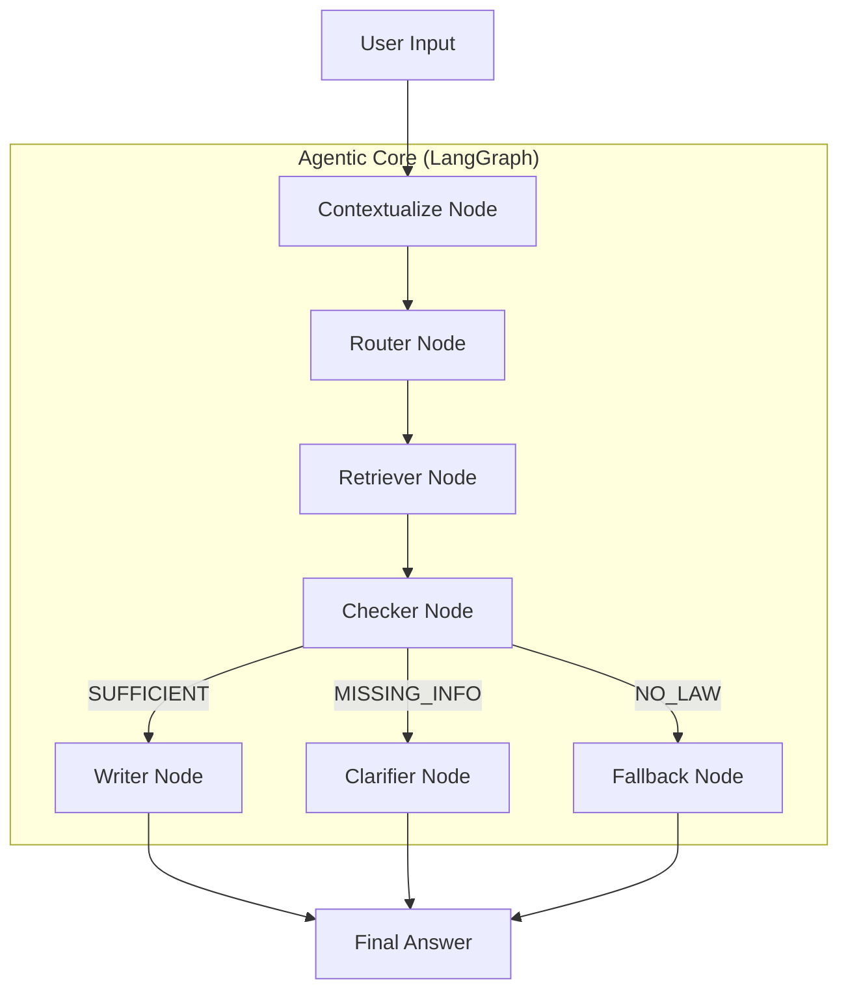

# Kiến trúc Agentic RAG - VN Legal Chatbot

Tài liệu này trình bày chi tiết về kiến trúc **Agentic RAG (Retrieval-Augmented Generation)** được triển khai trong dự án VN Legal Chatbot. Kiến trúc này sử dụng **LangGraph** để xây dựng một quy trình làm việc (workflow) có khả năng tự điều hướng, kiểm tra chất lượng và xử lý các tình huống phức tạp trong tư vấn pháp luật.

---

## 1. Sơ đồ Kiến trúc (Mermaid Diagram)

Dưới đây là luồng hoạt động của hệ thống từ khi nhận câu hỏi của người dùng cho đến khi trả ra kết quả cuối cùng:



---

## 2. Phân tích Chi tiết từng Node

Hệ thống được chia thành các Agent chuyên biệt, mỗi Agent đảm nhận một vai trò cụ thể trong chuỗi cung ứng thông tin.

### 2.1. Contextualize Node (Tiền xử lý & Viết lại câu hỏi)
**Chức năng:** Xử lý câu hỏi thô từ người dùng. Nếu có lịch sử trò chuyện, nó sẽ viết lại câu hỏi thành một câu hỏi độc lập (standalone query) để đảm bảo bộ phận tìm kiếm (retriever) hoạt động chính xác.

- **Kỹ thuật:** Sử dụng LLM với prompt chuyên biệt để tách biệt câu hỏi hiện tại khỏi ngữ cảnh lịch sử.
- **Trích xuất Code:**
```python
def contextualize_node(state: LawAgentState) -> LawAgentState:
    # Rewrite as standalone if chat history exists
    if chat_history:
        prompt = PromptTemplate(
            template="Dựa trên lịch sử hội thoại... hãy viết lại câu hỏi cuối cùng thành một câu hỏi pháp lý đầy đủ..."
        )
        chain = prompt | llm | StrOutputParser()
        standalone = chain.invoke({"chat_history": chat_history, "query": pure_query})
        state.standalone_query = standalone
```

### 2.2. Router Node (Điều hướng thông minh)
**Chức năng:** Phân loại ý định (intent) của người dùng và quyết định chiến thuật tìm kiếm (số lượng tài liệu `limit`).

**Các loại phân loại (Intents):**
1.  `SEARCH_PENAL`: Lĩnh vực Hình sự (Tội phạm, án tù...). **Limit: 10** (Cần lấy rộng để tránh sót khung hình phạt).
2.  `SEARCH_CIVIL`: Lĩnh vực Dân sự (Hợp đồng, đất đai, thừa kế...). **Limit: 5**.
3.  `SEARCH_PROCEDURE`: Thủ tục tố tụng/Hành chính (Nộp đơn, hồ sơ...). **Limit: 4**.
4.  `SEARCH_MARRIAGE`: Hôn nhân và gia đình. **Limit: 4**.
5.  `NO_SEARCH`: Chào hỏi xã giao hoặc câu hỏi không liên quan luật. **Limit: 0**.

- **Trích xuất Code (Quy tắc phân loại):**
```python
# Trích xuất từ router_agent.py
prompt = PromptTemplate(
    template="""Bạn là Router điều hướng câu hỏi pháp lý.
    QUY TẮC PHÂN LOẠI & LIMIT:
    1. "SEARCH_PENAL": Hình sự... Set limit = 10
    2. "SEARCH_CIVIL": Dân sự... Set limit = 5
    ...
    Trả về JSON: {"intent": "...", "limit": <số nguyên>}
    """
)
# Lưu vào State để node sau sử dụng
state.intent = decision.get("intent")
state.search_limit = decision.get("limit")
```

### 2.3. Retriever Node (Truy xuất tài liệu có điều kiện)
**Chức năng:** Sử dụng kết quả từ Router để thực hiện truy xuất chính xác trên Qdrant.

**Cách Retriever tận dụng Router:**
1.  **Sử dụng Limit động:** Thay vì lấy cố định 3-4 bản ghi, nó lấy theo con số mà Router tính toán (ví dụ: 10 cho Hình sự).
2.  **Domain Filtering (Lọc theo miền):** Sử dụng `intent` để đối chiếu với bảng từ khóa `DOMAIN_KEYWORDS`. Nếu tài liệu tìm được không thuộc đúng bộ luật đó, nó sẽ bị loại bỏ ngay lập tức.

- **Trích xuất Code (Sử dụng thông tin từ Router):**
```python
# Trích xuất từ retrieval_agent.py
def retriever_node(state: LawAgentState) -> LawAgentState:
    # 1. Lấy limit từ Router
    limit = state.search_limit or 4
    
    # 2. Tìm kiếm Vector
    results = qdrant.query_points(..., limit=limit)
    
    # 3. Lọc theo miền (Domain Filtering) dựa trên intent từ Router
    domain_filter = DOMAIN_KEYWORDS.get(state.intent, [])
    
    filtered_results = []
    for hit in results:
        loai_van_ban = hit.payload.get("loai_van_ban", "")
        # Nếu có domain_filter, phải khớp ít nhất một từ khóa mới giữ lại
        if domain_filter and not any(keyword in loai_van_ban for keyword in domain_filter):
            print(f"⚠️ Filtered: '{loai_van_ban}' (wrong domain for {state.intent})")
            continue
        filtered_results.append(hit)
```
**Bảng từ khóa lọc (DOMAIN_KEYWORDS):**
- `SEARCH_PENAL` -> ["Hình sự", "Tội phạm", "Bộ luật Hình sự"]
- `SEARCH_CIVIL` -> ["Dân sự", "Hợp đồng", "Bộ luật Dân sự"]
- ...

### 2.4. Checker Node (Kiểm tra độ đầy đủ)
**Chức năng:** Đây là node quan trọng nhất thể hiện tính "Agentic". Nó đóng vai trò như một Thẩm phán để đánh giá xem các đoạn luật tìm được có đủ để trả lời câu hỏi hay không.

- **Kỹ thuật:** Phân tích sự phù hợp giữa `Query` + `Context` + `Law`.
- **Ba trạng thái đầu ra:**
    1. `SUFFICIENT`: Đủ thông tin để trả lời.
    2. `MISSING_INFO`: Cần hỏi thêm chi tiết (ví dụ: cần biết giá trị tài sản bị trộm để định khung hình phạt).
    3. `NO_LAW`: Không tìm thấy căn cứ pháp lý.

### 2.5. Writer/Clarifier/Fallback Nodes (Phản hồi người dùng)
- **Writer Node:** Tổng hợp thông tin và viết câu trả lời theo phong cách luật sư chuyên nghiệp, có dẫn chiếu Điều, Khoản, Tên Luật.
- **Clarifier Node:** Đặt câu hỏi ngược lại cho người dùng khi thông tin bị thiếu.
- **Fallback Node:** Xử lý các tình huống ngoài phạm vi hoặc lỗi hệ thống một cách an toàn.

---

## 3. Tại sao kiến trúc này lại mạnh mẽ hơn RAG truyền thống?

| Tính năng | RAG truyền thống | Agentic RAG (Dự án này) |
| :--- | :--- | :--- |
| **Luồng xử lý** | Tuyến tính (Linear) | Có vòng lặp và rẽ nhánh (Graph-based) |
| **Độ chính xác** | Dễ bị "hallucination" nếu context sai | Có bước Checker để xác thực context trước khi trả lời |
| **Xử lý mơ hồ** | Cố gắng trả lời dù thiếu thông tin | Biết hỏi lại người dùng để làm rõ (Clarifier) |
| **Tối ưu tìm kiếm** | Tìm kiếm mù quáng | Router quyết định chiến thuật tìm kiếm theo từng lĩnh vực |

---

## 4. Hướng dẫn trả lời phỏng vấn

Khi được hỏi về kiến trúc này, bạn nên tập trung vào các ý sau:

1.  **Tính Deterministic (Tính xác định):** "Hệ thống không chỉ là một con bot Chat, nó là một Workflow được kiểm soát bởi LangGraph. Tôi đã thiết lập các trạng thái (State) và các cạnh có điều kiện (Conditional Edges) để đảm bảo bot không bao giờ tự ý bịa đặt luật."
2.  **Kỹ thuật Multi-Agent:** "Tôi chia nhỏ nhiệm vụ cho các Agent: một ông chuyên tìm kiếm, một ông chuyên kiểm tra chất lượng, và một ông chuyên biên tập. Điều này giúp tối ưu hóa Prompt và giảm thiểu sai sót."
3.  **Xử lý dữ liệu thực tế:** "Trong luật pháp, thông tin người dùng đưa ra thường rất thiếu sót. Kiến trúc của tôi giải quyết vấn đề này bằng node **Checker**. Nếu người dùng hỏi 'Trộm cắp bị phạt gì?', bot sẽ không trả lời ngay một khung hình phạt vu vơ mà sẽ hỏi lại về giá trị tài sản để đưa ra tư vấn chính xác nhất."
4.  **Kiểm soát chất lượng (Thresholding):** "Tôi áp dụng ngưỡng Similarity Score là 0.60 và lọc theo Domain để đảm bảo tài liệu luật lấy ra là chính thống và phù hợp nhất."

---

## 5. Trích xuất Code chính (LangGraph Definition)

```python
# Định nghĩa Graph trong graph.py
workflow = StateGraph(LawAgentState)

# Thêm các node
workflow.add_node("contextualize", contextualize_node)
workflow.add_node("router", router_node)
workflow.add_node("retriever", retriever_node)
workflow.add_node("checker", sufficiency_checker_node)

# Thiết lập luồng đi
workflow.set_entry_point("contextualize")
workflow.add_edge("contextualize", "router")
workflow.add_edge("router", "retriever")
workflow.add_edge("retriever", "checker")

# Rẽ nhánh dựa trên kết quả của Checker
workflow.add_conditional_edges(
    "checker",
    route_after_check,
    {
        "answer": "answer",
        "clarifier": "clarifier",
        "fallback": "fallback",
    },
)
```
