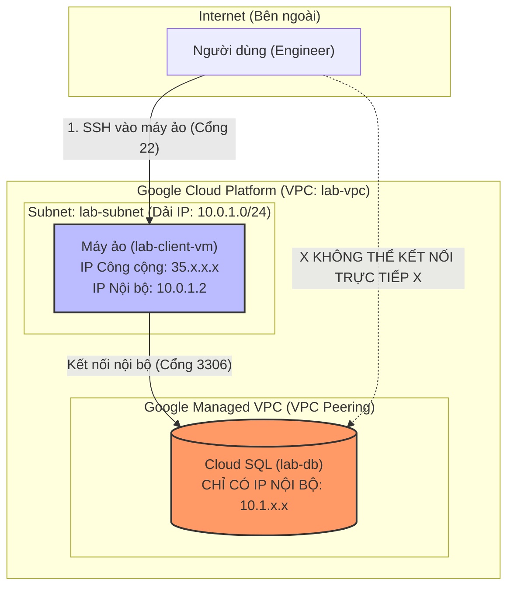

## Mục tiêu
Hiểu cách thiết lập hạ tầng mạng bảo mật cho ứng dụng AI. Bạn sẽ tạo một mạng nội bộ (VPC), một cơ sở dữ liệu MySQL (Cloud SQL) chỉ có địa chỉ IP nội bộ (Private IP) và thực hiện kết nối từ một máy ảo (VM) nằm trong cùng mạng.

## Mô hình kiến trúc (Architecture Diagram)



**Giải thích luồng kết nối:**
1. **Engineer (Bạn):** Dùng máy tính cá nhân kết nối vào máy ảo (VM) thông qua địa chỉ **Public IP** (cổng 22 - SSH).
2. **VM Instance:** Sau khi bạn đã ở trong máy ảo, bạn đang đứng "bên trong hàng rào" VPC. Từ đây, bạn dùng địa chỉ **Private IP** của Database để kết nối.
3. **Database:** Tuyệt đối an toàn vì không có Public IP, internet không thể chạm tới.

---

## Hướng dẫn thực hành chi tiết (CLI Linux & Web Console)

### Bước 1: Tạo VPC Network (Mạng nội bộ riêng)
- **CLI (Bash):**
  ```bash
  export NETWORK_NAME="lab-vpc"
  gcloud compute networks create $NETWORK_NAME --subnet-mode=custom
  ```
- **Console (Web):** 
  1. Tìm kiếm "VPC network" trên thanh công cụ.
  2. Chọn **Create VPC Network**.
  3. Tên: `lab-vpc`.
  4. Subnet mode: Chọn **Custom**.

### Bước 2: Tạo Subnet (Phân mạng)
- **CLI (Bash):**
  ```bash
  gcloud compute networks subnets create lab-subnet \
      --network=$NETWORK_NAME \
      --range=10.0.1.0/24 \
      --region=asia-southeast1
  ```
- **Console (Web):** 
  1. Trong màn hình tạo VPC, nhấn **Add subnet**.
  2. Tên: `lab-subnet`.
  3. Region: Chọn **asia-southeast1** (Singapore).
  4. IP range: Nhập `10.0.1.0/24`.
  5. Nhấn **Done** và nhấn **Create** ở cuối trang.

### Bước 3: Thiết lập Private Services Access (Bắt buộc cho Private IP SQL)
Để Cloud SQL có thể kết nối vào VPC của bạn, bạn cần cấp một dải IP cho các dịch vụ của Google.
- **CLI (Bash):**
  ```bash
  # Cấp dải IP cho Google
  gcloud compute addresses create google-managed-services-vpc-network \
      --global --purpose=VPC_PEERING --addresses=10.1.0.0 --prefix-length=16 --network=$NETWORK_NAME

  # Thiết lập kết nối Peering
  gcloud services vpc-peerings connect --service=servicenetworking.googleapis.com \
      --network=$NETWORK_NAME --ranges=google-managed-services-vpc-network
  ```
- **Console (Web):** 
  1. Trong menu VPC Network, chọn **VPC network peering**.
  2. Chọn **Private service access** -> **Allocate IP range**.
  3. Đặt tên và dải IP (ví dụ: `10.1.0.0/16`).
  4. Sau đó nhấn **Connect to service**.

### Bước 4: Tạo Cloud SQL Instance (Private IP)
- **CLI (Bash):**
  ```bash
  gcloud sql instances create lab-db \
      --database-version=MYSQL_8_0 --cpu=1 --memory=3840MiB \
      --region=asia-southeast1 --network=$NETWORK_NAME --no-assign-ip
  ```
- **Console (Web):** 
  1. Vào menu **SQL** -> **Create Instance** -> **MySQL**.
  2. Đặt tên ID: `lab-db`, mật khẩu root: `admin123`.
  3. Tại mục **Connections**, chọn **Private IP** và chọn mạng `lab-vpc`. 
  4. Bỏ chọn mục **Public IP**.
  5. Nhấn **Create Instance** (Quá trình này mất khoảng 5-10 phút).

### Bước 5: Tạo máy ảo (VM) và Kiểm tra kết nối
- **CLI (Bash):**
  ```bash
  # Tạo máy ảo trong cùng mạng VPC
  gcloud compute instances create lab-client-vm \
      --zone=asia-southeast1-a --network=$NETWORK_NAME --subnet=lab-subnet \
      --image-family=debian-11 --image-project=debian-cloud
  ```
- **Console (Web):** Menu **Compute Engine** -> **VM Instances** -> **Create Instance** -> Tại mục **Networking**, chọn mạng `lab-vpc` và subnet `lab-subnet`.

**Thực hiện kết nối thử:**
1. SSH vào máy ảo: `gcloud compute ssh lab-client-vm --zone=asia-southeast1-a`
2. Cài đặt client: `sudo apt update && sudo apt install mariadb-client -y`
3. Tìm IP nội bộ của Database trong menu SQL trên Web.
4. Chạy lệnh: `mysql -h [IP_DATABASE_CỦA_BẠN] -u root -p` (Nhập mật khẩu `admin123`).

### Bước 6: Dọn dẹp
*Cực kỳ quan trọng để không bị phát sinh chi phí.*
- **CLI:** 
  ```bash
  gcloud compute instances delete lab-client-vm --zone=asia-southeast1-a -q
  gcloud sql instances delete lab-db -q
  gcloud compute networks delete $NETWORK_NAME -q
  ```

---

## Kết quả đạt được
- Hiểu cách tạo mạng VPC và chia Subnet.
- Biết cách cấu hình Database bảo mật (chỉ truy cập nội bộ).
- Biết cách kết nối các tài nguyên trong cùng một VPC.
