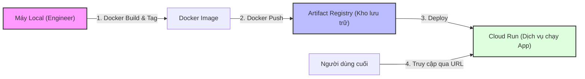

# Lab 3: Docker, Artifact Registry & Cloud Run

## Mục tiêu
Học cách đóng gói ứng dụng AI vào Container (Docker), lưu trữ chúng trên kho quản lý tập trung (Artifact Registry) và triển khai chúng dưới dạng Serverless (Cloud Run). Đây là quy trình hiện đại nhất để vận hành ứng dụng AI mà không cần quan tâm đến việc quản lý máy ảo (VM).

## Mô hình kiến trúc (Architecture Diagram)



---

## Hướng dẫn thực hành chi tiết (CLI Linux & Web Console)

### Bước 1: Chuẩn bị ứng dụng mẫu (FastAPI)
Chúng ta sẽ tạo một ứng dụng AI đơn giản trả về một thông điệp.
1. Tạo thư mục bài lab: `mkdir lab3-cloudrun && cd lab3-cloudrun`
2. Tạo file `main.py`:
```python
from fastapi import FastAPI
import os

app = FastAPI()

@app.get("/")
def read_root():
    return {"message": "Xin chào từ AI Intelligence Platform trên Cloud Run!"}

if __name__ == "__main__":
    import uvicorn
    # Cloud Run yêu cầu ứng dụng lắng nghe trên cổng được chỉ định bởi biến môi trường PORT
    port = int(os.environ.get("PORT", 8080))
    uvicorn.run(app, host="0.0.0.0", port=port)
```

### Bước 2: Tạo Dockerfile
Dockerfile là "công thức" để đóng gói ứng dụng. Tạo file `Dockerfile` trong cùng thư mục:
```dockerfile
# Sử dụng phiên bản Python nhẹ (slim)
FROM python:3.11-slim

# Thiết lập thư mục làm việc trong container
WORKDIR /app

# Copy tất cả file hiện tại vào container
COPY . .

# Cài đặt các thư viện cần thiết
RUN pip install fastapi uvicorn

# Thông báo cổng ứng dụng
EXPOSE 8080

# Lệnh khởi chạy ứng dụng
CMD ["python", "main.py"]
```

### Bước 3: Tạo Artifact Registry (Kho lưu trữ Image)
- **CLI (Bash):**
  ```bash
  export REGION="asia-southeast1"
  export REPO_NAME="ai-repo"
  
  gcloud artifacts repositories create $REPO_NAME \
      --repository-format=docker \
      --location=$REGION \
      --description="Kho luu tru Docker images"
  ```
- **Console (Web):** 
  1. Tìm kiếm **Artifact Registry** trên thanh công cụ.
  2. Nhấn **Create Repository**.
  3. Format: **Docker**, Region: **asia-southeast1** (Singapore).
  4. Tên: `ai-repo`.

### Bước 4: Build và Push Docker Image
Để Cloud có thể chạy ứng dụng, bạn phải đẩy image từ máy mình lên Artifact Registry.
- **CLI (Bash):**
  ```bash
  # 1. Cấu hình xác thực Docker với GCP (Chỉ cần làm 1 lần)
  gcloud auth configure-docker asia-southeast1-docker.pkg.dev

  # 2. Build và gắn thẻ (Tag) cho Image
  # Cấu trúc: [Vùng]-docker.pkg.dev/[Project-ID]/[Tên-Repo]/[Tên-Image]:[Phiên-bản]
  export IMAGE_TAG="asia-southeast1-docker.pkg.dev/$PROJECT_ID/$REPO_NAME/hello-ai:v1"
  docker build -t $IMAGE_TAG .

  # 3. Đẩy Image lên Cloud
  docker push $IMAGE_TAG
  ```

### Bước 5: Triển khai lên Cloud Run (Serverless)
Cloud Run sẽ lấy image từ kho lưu trữ và tạo một đường link (URL) công cộng.
- **CLI (Bash):**
  ```bash
  gcloud run deploy hello-ai-service \
      --image $IMAGE_TAG \
      --region $REGION \
      --platform managed \
      --allow-unauthenticated
  ```
- **Console (Web):** 
  1. Tìm kiếm **Cloud Run** -> **Create Service**.
  2. Chọn **Deploy one revision from an existing container image**.
  3. Chọn image `hello-ai:v1` từ Artifact Registry vừa đẩy lên.
  4. Tại mục **Authentication**, chọn **Allow unauthenticated invocations**.
  5. Nhấn **Create**.

**Kết quả:** Sau khi hoàn tất, bạn sẽ thấy một **URL** hiện ra. Hãy copy và dán vào trình duyệt để xem thông điệp "Xin chào...".

### Bước 6: Dọn dẹp
- **CLI:**
  ```bash
  # Xóa dịch vụ Cloud Run
  gcloud run services delete hello-ai-service --region $REGION -q
  # Xóa kho lưu trữ image
  gcloud artifacts repositories delete $REPO_NAME --location=$REGION -q
  ```

---

## Kết quả đạt được
- Biết cách Dockerize một ứng dụng AI đơn giản.
- Hiểu quy trình lưu trữ và quản lý phiên bản container chuyên nghiệp.
- Biết cách triển khai ứng dụng Serverless, tự động co giãn theo lưu lượng truy cập.
