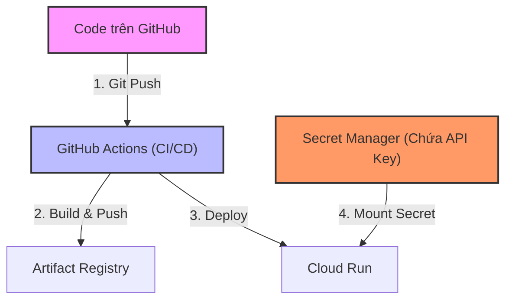

# Lab 4: Secret Manager & CI/CD Pipeline

## Mục tiêu
Học cách vận hành ứng dụng AI theo tiêu chuẩn chuyên nghiệp:
1. **Bảo mật (Secret Manager):** Lưu trữ các thông tin nhạy cảm (API Keys, Database Passwords) an toàn, không để lộ trong mã nguồn.
2. **Tự động hóa (CI/CD):** Thiết lập luồng tự động triển khai bằng GitHub Actions, giúp cập nhật ứng dụng ngay khi có thay đổi code.

## Mô hình kiến trúc (Architecture Diagram)



---

## Hướng dẫn thực hành chi tiết (CLI Linux & Web Console)

### Bước 1: Bảo mật thông tin với Secret Manager
Giả sử ứng dụng AI của bạn cần `OPENAI_API_KEY` để hoạt động.
- **CLI (Bash):**
  ```bash
  export SECRET_NAME="OPENAI_API_KEY"
  export SECRET_VALUE="sk-xxxx-your-real-key" # Thay bằng key thật của bạn
  
  # 1. Tạo Secret container
  gcloud secrets create $SECRET_NAME --replication-policy="automatic"
  
  # 2. Thêm giá trị cho Secret (Phiên bản 1)
  echo -n "$SECRET_VALUE" | gcloud secrets versions add $SECRET_NAME --data-file=-
  ```
- **Console (Web):** 
  1. Tìm kiếm **Secret Manager** trên thanh công cụ.
  2. Nhấn **Create Secret**.
  3. Tên: `OPENAI_API_KEY`.
  4. Secret value: Dán key của bạn vào.
  5. Nhấn **Create Secret**.

### Bước 2: Cấp quyền cho Cloud Run truy cập Secret
Mặc định, các dịch vụ trên GCP bị cô lập. Bạn phải cho phép Cloud Run đọc dữ liệu từ Secret Manager.
- **CLI (Bash):**
  ```bash
  # Lấy Project Number (Mã số dự án, khác với Project ID)
  export PROJECT_NUMBER=$(gcloud projects describe $PROJECT_ID --format='value(projectNumber)')
  
  # Cấp quyền cho Service Account mặc định mà Cloud Run sử dụng
  gcloud projects add-iam-policy-binding $PROJECT_ID \
      --member="serviceAccount:$PROJECT_NUMBER-compute@developer.gserviceaccount.com" \
      --role="roles/secretmanager.secretAccessor"
  ```
- **Console (Web):** 
  1. Trong giao diện Secret Manager, chọn secret `OPENAI_API_KEY`.
  2. Chọn tab **Permissions**.
  3. Nhấn **Grant Access**.
  4. New principals: Nhập `[PROJECT_NUMBER]-compute@developer.gserviceaccount.com`.
  5. Role: Chọn **Secret Manager Secret Accessor**.
  6. Nhấn **Save**.

### Bước 3: Thiết lập GitHub Actions (CI/CD)
Để tự động hóa, chúng ta cần dạy cho GitHub cách đăng nhập vào GCP của bạn.
1. **Tạo Service Account cho GitHub:**
   ```bash
   gcloud iam service-accounts create github-deployer
   
   # Cấp quyền Editor cho SA này để nó có thể Deploy
   gcloud projects add-iam-policy-binding $PROJECT_ID \
       --member="serviceAccount:github-deployer@$PROJECT_ID.iam.gserviceaccount.com" \
       --role="roles/editor"
   
   # Tạo file JSON key để GitHub đăng nhập
   gcloud iam service-accounts keys create gcp-key.json \
       --iam-account=github-deployer@$PROJECT_ID.iam.gserviceaccount.com
   ```
2. **Cấu hình trên GitHub:**
   - Vào Repository của bạn -> **Settings** -> **Secrets and variables** -> **Actions**.
   - Thêm `GCP_PROJECT_ID`: ID dự án của bạn.
   - Thêm `GCP_SA_KEY`: Nội dung file `gcp-key.json` vừa tạo.

3. **Tạo file workflow:** Tạo file `.github/workflows/deploy.yml` trong project của bạn:
```yaml
name: Deploy to Cloud Run
on:
  push:
    branches: [ main ]
jobs:
  deploy:
    runs-on: ubuntu-latest
    steps:
      - uses: actions/checkout@v4
      - name: Google Auth
        uses: 'google-github-actions/auth@v2'
        with:
          credentials_json: '${{ secrets.GCP_SA_KEY }}'
      - name: Set up Cloud SDK
        uses: 'google-github-actions/setup-gcloud@v2'
      - name: Build and Push
        run: |
          gcloud auth configure-docker asia-southeast1-docker.pkg.dev
          docker build -t asia-southeast1-docker.pkg.dev/${{ secrets.GCP_PROJECT_ID }}/ai-repo/hello-ai:${{ github.sha }} .
          docker push asia-southeast1-docker.pkg.dev/${{ secrets.GCP_PROJECT_ID }}/ai-repo/hello-ai:${{ github.sha }}
      - name: Deploy to Cloud Run
        run: |
          gcloud run deploy hello-ai-service \
            --image asia-southeast1-docker.pkg.dev/${{ secrets.GCP_PROJECT_ID }}/ai-repo/hello-ai:${{ github.sha }} \
            --set-secrets="OPENAI_API_KEY=OPENAI_API_KEY:latest" \
            --region asia-southeast1 \
            --platform managed \
            --allow-unauthenticated
```

### Bước 4: Kiểm tra tính tự động hóa
1. Sửa file `main.py` (ví dụ: đổi câu chào).
2. `git add .`, `git commit -m "test ci/cd"`, `git push origin main`.
3. Quan sát tab **Actions** trên GitHub. Sau khi xanh (Success), hãy truy cập URL Cloud Run để thấy thay đổi.

### Bước 5: Dọn dẹp
- **CLI:**
  ```bash
  gcloud secrets delete $SECRET_NAME -q
  gcloud iam service-accounts delete github-deployer@$PROJECT_ID.iam.gserviceaccount.com -q
  ```

---

## Kết quả đạt được
- Biết cách quản lý thông tin nhạy cảm an toàn tuyệt đối.
- Hiểu cách phân quyền giữa các dịch vụ đám mây (Cloud Run <-> Secret Manager).
- Làm chủ quy trình triển khai tự động chuyên nghiệp cho các dự án AI lớn.
