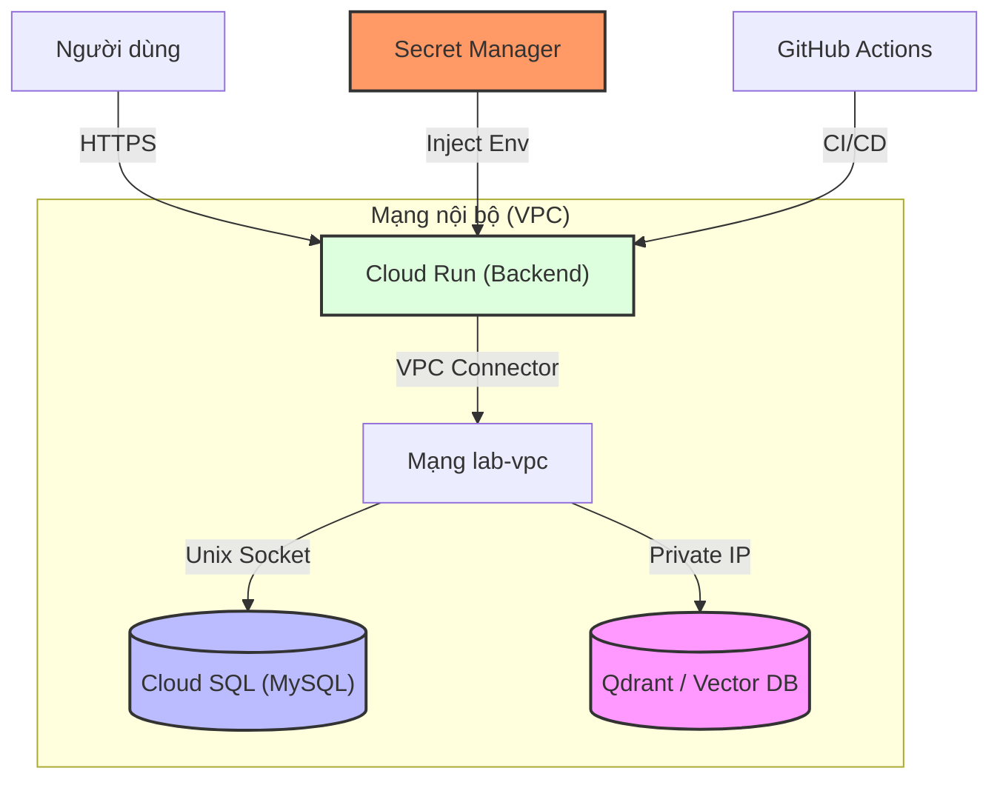

# Lab 5: MLOps End-to-End: Deploy an AI Application

## Mục tiêu
Đây là bài lab tổng hợp (Grand Finale). Bạn sẽ kết hợp tất cả kiến thức từ Lab 1 đến Lab 4 để triển khai một hệ thống AI hoàn chỉnh:
1. **Tích hợp:** Kết nối Cloud Run (App) với Cloud SQL (Database) thông qua hạ tầng mạng bảo mật.
2. **Cấu hình phức hợp:** Quản lý hàng loạt biến môi trường và Secret.
3. **Vận hành thực tế:** Thiết lập VPC Connector, giám sát Logs và quản lý chi phí.

## Mô hình kiến trúc (Architecture Diagram)



---

## Hướng dẫn thực hành chi tiết (CLI Linux & Web Console)

### Bước 1: Tạo VPC Access Connector
Để các dịch vụ Serverless như Cloud Run có thể truy cập vào các tài nguyên nội bộ (như Cloud SQL Private IP), bạn cần một "cây cầu" gọi là VPC Connector.
- **CLI (Bash):**
  ```bash
  export REGION="asia-southeast1"
  
  gcloud compute networks vpc-access connectors create my-connector \
      --region=$REGION \
      --range=10.8.0.0/28 \
      --network=lab-vpc
  ```
- **Console (Web):** 
  1. Tìm kiếm **Serverless VPC access**.
  2. Nhấn **Create Connector**.
  3. Name: `my-connector`, Network: `lab-vpc`, IP range: `10.8.0.0/28`.

### Bước 2: Cấu hình Secret đầy đủ
Hãy đảm bảo bạn đã lưu đầy đủ các thông tin sau vào Secret Manager (xem lại Lab 4):
1. `OPENAI_API_KEY`: Key chạy mô hình AI.
2. `DB_PASSWORD`: Mật khẩu tài khoản root của MySQL.

### Bước 3: Triển khai ứng dụng kết nối đa dịch vụ
Chúng ta sẽ triển khai Cloud Run với cấu hình kết nối tới Cloud SQL và sử dụng VPC Connector.
- **CLI (Bash):**
  ```bash
  gcloud run deploy ai-backend-service \
      --image asia-southeast1-docker.pkg.dev/$PROJECT_ID/ai-repo/hello-ai:v1 \
      --region $REGION \
      --vpc-connector my-connector \
      --add-cloudsql-instances $PROJECT_ID:$REGION:lab-db \
      --set-env-vars="DB_USER=root,DB_NAME=law_db,CLOUD_SQL_CONNECTION_NAME=$PROJECT_ID:$REGION:lab-db" \
      --set-secrets="DB_PASS=DB_PASSWORD:latest,OPENAI_API_KEY=OPENAI_API_KEY:latest" \
      --allow-unauthenticated
  ```
- **Console (Web):** 
  1. Trong Cloud Run -> **Create Service**.
  2. Tab **Containers**: Cấu hình **Variables & Secrets**. Thêm các biến môi trường và map với Secret Manager.
  3. Tab **Cloud SQL**: Nhấn **Add Instance** và chọn `lab-db`.
  4. Tab **Networking**: Tại mục **VPC Connectivity**, chọn **Route all traffic through the VPC connector** và chọn `my-connector`.

### Bước 4: Giám sát Logs và Debug
Sau khi Deploy, nếu web báo lỗi "Internal Server Error", bạn cần xem log để biết code Python bị lỗi ở dòng nào.
- **Console (Web):** 
  1. Vào Cloud Run -> Chọn service `ai-backend-service`.
  2. Chọn tab **Logs**.
  3. Tại đây, bạn sẽ thấy mọi lỗi `Database Connection Error` hoặc `API Key Invalid` hiện ra rõ ràng.

### Bước 5: Quản lý chi phí (Budget Alerts)
Đây là bước quan trọng để bảo vệ ví tiền của bạn.
- **Console (Web):** 
  1. Tìm kiếm **Billing** -> **Budgets & Alerts**.
  2. Nhấn **Create Budget**.
  3. Đặt tên: `AI Project Budget`.
  4. Amount: Chọn `Specified amount` và nhập `10` (USD).
  5. Tại mục **Actions**, đảm bảo tích chọn gửi email thông báo khi đạt 50%, 90% ngân sách.

### Bước 6: Tổng kết và Dọn dẹp
Khi đã học xong, hãy xóa toàn bộ project để dừng việc tính phí:
- **CLI:** `gcloud projects delete $PROJECT_ID`

---

## Kết quả đạt được
Chúc mừng bạn! Bạn đã hoàn thành lộ trình thực hành 5 bài Lab để trở thành một AI Engineer am hiểu hạ tầng Cloud:
1. Bạn biết cách bảo mật ứng dụng tuyệt đối (Secret Manager + Private IP).
2. Bạn biết cách kết nối các dịch vụ phức tạp trong mạng nội bộ VPC.
3. Bạn làm chủ quy trình MLOps tự động hóa hoàn toàn.
4. Bạn biết cách giám sát lỗi và quản lý chi phí vận hành.

---
**Dự án VN Legal Intelligence Platform của bạn hiện đã có một nền tảng hạ tầng vững chắc!**
